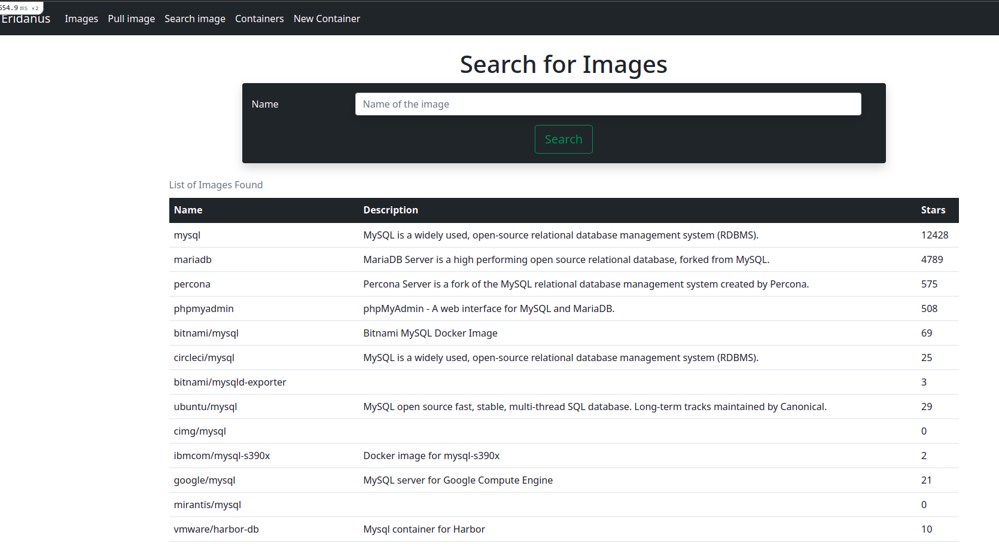
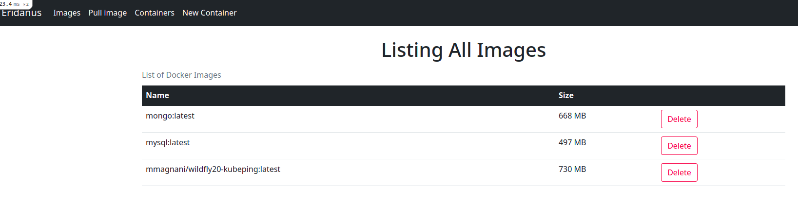
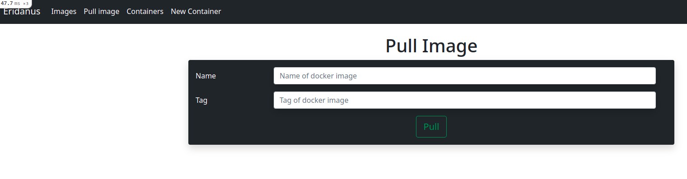
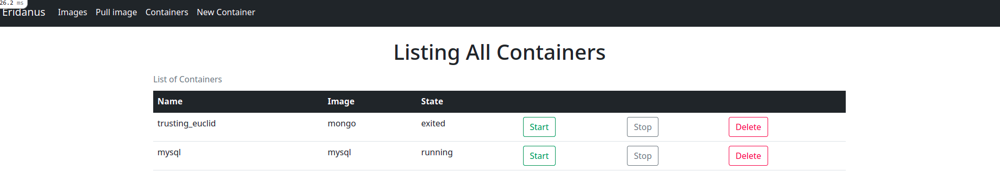

# Eridanus Container Manager

Eridanus Container Manage is a web application developed to exercise new features present in Ruby on Rails 6.

## Search Images

## List Images

## Pull Image

## List Containers

## Create a New Container

